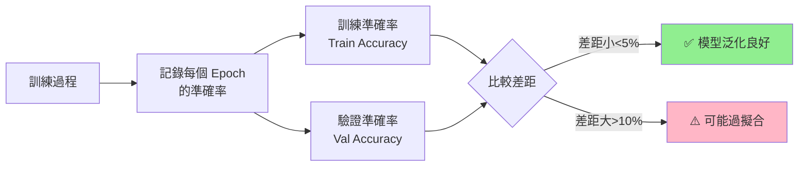

## 概述

本專案使用 **ResNet** 架構進行影像分類任務，採用了多項進階訓練技巧來提升模型性能並避免過擬合。

### 基本設定

- **模型架構**: ResNet
- **輸入尺寸**: 360 × 640 × 3 (攝影機最小尺寸)
- **類別數量**: 3 類(有豬、沒豬和攝影機故障)
- **批次大小**: 32
- **最大訓練輪數**: 1000 epochs
- **訓練/驗證比例**: 80% / 20%

---

## 訓練策略

### 1. 🎲 隨機種子策略

每次訓練使用**隨機產生的種子**，確保資料分割的多樣性：

```python
random_seed = random.randint(1, 10000)
print(f"使用隨機種子: {random_seed}")
```

**優點：**

- 避免模型過度依賴特定的資料分割
- 增加訓練的泛化能力
- 每次訓練都能探索不同的資料分布
- **訓練結束時能夠測試不同的驗證集**

### 2. 📉 自動學習率調整 (ReduceLROnPlateau)

當驗證損失不再下降時，**自動降低學習率**：

```python
lr_reducer = ReduceLROnPlateau(
    monitor='val_loss',      # 監控驗證損失
    factor=0.5,              # 學習率降低為原本的 50%
    patience=5,              # 5 個 epoch 沒改善就降低
    min_lr=1e-6              # 最小學習率限制
)
```

**工作原理：**

- 持續監控 `val_loss`
- 如果連續 5 個 epoch 沒有改善
- 學習率 × 0.5（例如：0.001 → 0.0005）
- 直到學習率達到最小值 1e-6

### 3. ⏹️ 早停機制 (EarlyStopping)

當模型性能不再提升時，**自動停止訓練**：

```python
early_stopping = EarlyStopping(
    monitor='val_loss',           # 監控驗證損失
    patience=10,                  # 10 個 epoch 沒改善就停止
    restore_best_weights=True     # 恢復最佳權重
)
```

**優點：**

- 防止過度訓練（overfitting）
- 節省訓練時間和運算資源
- 自動恢復到驗證表現最佳的權重

### 4. 💾 最佳模型保存 (BestModelCheckpoint)

**自訂回調函數**，只保留驗證準確率最高的模型權重：

```python
class BestModelCheckpoint(Callback):
    def __init__(self, filepath_template, monitor='val_accuracy', mode='max'):
        # 初始化參數
        self.best = -float('inf')  # 最佳準確率
        self.current_filepath = None
    
    def on_epoch_end(self, epoch, logs=None):
        current = logs.get(self.monitor)
        
        # 檢查是否有改善
        if current > self.best:
            # 刪除舊的權重檔案
            if self.current_filepath and os.path.exists(self.current_filepath):
                os.remove(self.current_filepath)
            
            # 保存新的最佳權重
            self.best = current
            new_filepath = self.filepath_template.format(val_accuracy=current)
            self.model.save_weights(new_filepath)
            self.current_filepath = new_filepath
```

**特點：**

- 自動刪除舊的權重檔案，節省磁碟空間
- 檔案名稱包含準確率，方便識別
- 檔案名稱格式：`best_resnet_model_360x640_{日期時間}_rs{隨機種子}_val_acc_{準確率}.h5`

### 5. 🔄 資料增強 (Data Augmentation)

**訓練集**使用大量資料增強技術：

```python
train_datagen = ImageDataGenerator(
    preprocessing_function=preprocess_input,
    rotation_range=40,              # 隨機旋轉 ±40度
    width_shift_range=0.3,          # 水平平移 ±30%
    height_shift_range=0.3,         # 垂直平移 ±30%
    zoom_range=0.2,                 # 隨機縮放 ±20%
    shear_range=0.2,                # 剪切變換 ±20%
    brightness_range=[0.8, 1.2],    # 亮度調整 80%-120%
    horizontal_flip=True            # 隨機水平翻轉
)
```

**驗證集**不進行資料增強：

```python
val_datagen = ImageDataGenerator(
    preprocessing_function=preprocess_input  # 僅標準化
)
```

---

## 核心技術細節

### 資料分割流程

1. **讀取原始資料夾結構**

   ```
   data/
   ├── 類別1/
   │   ├── image1.jpg
   │   └── image2.jpg
   ├── 類別2/
   └── 類別3/
   ```

2. **使用 `train_test_split` 分割**

   - 每個類別獨立分割（保持類別平衡）
   - 80% 訓練，20% 驗證
   - 使用隨機種子確保可重現

3. **建立臨時目錄結構**

   ```
   temp_train/          temp_val/
   ├── 類別1/          ├── 類別1/
   ├── 類別2/          ├── 類別2/
   └── 類別3/          └── 類別3/
   ```

4. **訓練完成後自動清理臨時目錄**

### 錯誤案例分析

訓練完成後，系統會**自動分析並顯示所有分類錯誤的案例**：

```python
# 找出所有分錯的圖片
for i in range(len(predicted_labels)):
    if predicted_labels[i] != true_labels[i]:
        wrong_predictions.append({
            'filename': val_filenames[i],
            'true_label': class_names[true_labels[i]],
            'predicted_label': class_names[predicted_labels[i]],
            'confidence': predictions[i][predicted_labels[i]]
        })

# 打印詳細資訊
print(f"\n總共找到 {len(wrong_predictions)} 張分錯的圖片：")
for i, wp in enumerate(wrong_predictions, 1):
    print(f"{i:3d}. {os.path.basename(wp['filename'])}")
    print(f"     True Label: {wp['true_label']}")
    print(f"     Predicted Label: {wp['predicted_label']}")
    print(f"     Confidence: {wp['confidence']:.4f}")
```

**輸出範例：**

```
總共找到 15 張分錯的圖片：
================================================================================
  1. image_0045.jpg
     True Label: 類別A
     Predicted Label: 類別B
     Confidence: 0.8523
------------------------------------------------------------
  2. image_0123.jpg
     True Label: 類別B
     Predicted Label: 類別C
     Confidence: 0.6741
```

每張錯誤圖片會自動顯示，標題包含：

- 檔案名稱
- 真實標籤 vs 預測標籤
- 模型信心度

---

## 訓練流程圖

### 整體訓練流程

```mermaid
flowchart TD
    Start([開始訓練]) --> RandomSeed[產生隨機種子<br/>1-10000]
    RandomSeed --> SplitData[資料分割<br/>80% 訓練 / 20% 驗證]
    SplitData --> CreateTemp[建立臨時目錄<br/>temp_train / temp_val]
    CreateTemp --> LoadData[載入資料<br/>含資料增強]
    LoadData --> CreateModel[建立 ResNet 模型]
    CreateModel --> SetCallbacks[設定回調函數<br/>- BestModelCheckpoint<br/>- EarlyStopping<br/>- ReduceLROnPlateau]
    SetCallbacks --> TrainLoop[開始訓練循環<br/>最多 1000 epochs]
    
    TrainLoop --> EpochEnd{Epoch 結束}
    EpochEnd --> CheckBest{驗證準確率<br/>是否為最佳？}
    CheckBest -->|是| SaveBest[保存新的最佳權重<br/>刪除舊權重]
    CheckBest -->|否| CheckLR{驗證損失<br/>5 epochs 沒改善？}
    SaveBest --> CheckLR
    
    CheckLR -->|是| ReduceLR[學習率 × 0.5]
    CheckLR -->|否| CheckEarly
    ReduceLR --> CheckEarly{驗證損失<br/>10 epochs 沒改善？}
    
    CheckEarly -->|是| StopTrain[早停：停止訓練<br/>恢復最佳權重]
    CheckEarly -->|否| ContinueTrain{達到<br/>最大 epochs？}
    
    ContinueTrain -->|否| TrainLoop
    ContinueTrain -->|是| StopTrain
    
    StopTrain --> LoadBest[載入最佳權重]
    LoadBest --> PlotResults[繪製訓練曲線<br/>Loss / Accuracy]
    PlotResults --> Evaluate[評估驗證集]
    Evaluate --> FindErrors[找出分類錯誤的案例]
    FindErrors --> PrintErrors[打印錯誤詳情<br/>- 檔案名稱<br/>- 真實/預測標籤<br/>- 信心度]
    PrintErrors --> ShowImages[顯示錯誤圖片]
    ShowImages --> Cleanup[清理臨時目錄]
    Cleanup --> End([訓練完成])
```



---

| 參數                         | 建議值 | 說明               |
| ---------------------------- | ------ | ------------------ |
| `ReduceLROnPlateau.patience` | 5      | 適合中等規模資料集 |
| `ReduceLROnPlateau.factor`   | 0.5    | 漸進式降低學習率   |
| `EarlyStopping.patience`     | 10     | 給模型充分調整時間 |
| `train_ratio`                | 0.8    | 經典的 80/20 分割  |
| `batch_size`                 | 32     | 平衡速度與記憶體   |
| `max_epochs`                 | 1000   | 設定高值，依賴早停 |

---

## 📊 訓練結果與正確率比較

### 自動生成訓練曲線圖

訓練完成後會自動生成 **`training_plots.png`**，包含訓練和驗證的損失與準確率比較：

```python
# 繪製損失和準確率折線圖
plt.figure(figsize=(12, 4))

# 損失圖
plt.subplot(1, 2, 1)
plt.plot(history.history['loss'], label='Train Loss')
plt.plot(history.history['val_loss'], label='Validation Loss')
plt.title('Loss Over Epochs')
plt.xlabel('Epoch')
plt.ylabel('Loss')
plt.legend()

# 準確率圖
plt.subplot(1, 2, 2)
plt.plot(history.history['accuracy'], label='Train Accuracy')
plt.plot(history.history['val_accuracy'], label='Validation Accuracy')
plt.title('Accuracy Over Epochs')
plt.xlabel('Epoch')
plt.ylabel('Accuracy')
plt.legend()

plt.savefig('training_plots.png')
plt.show()
```

### 正確率比較流程

